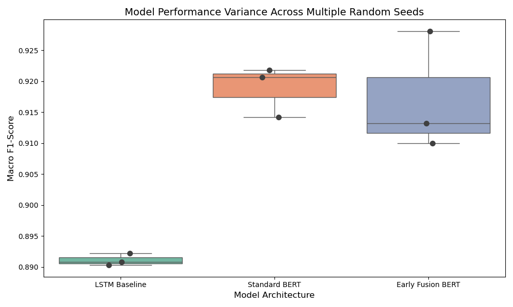
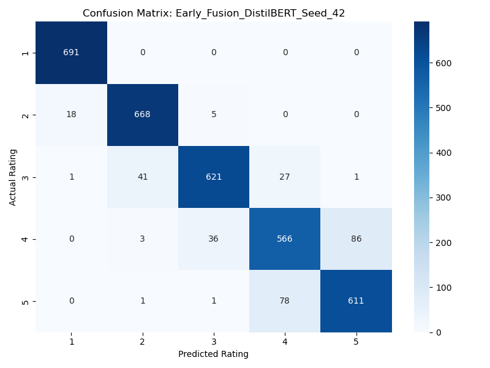
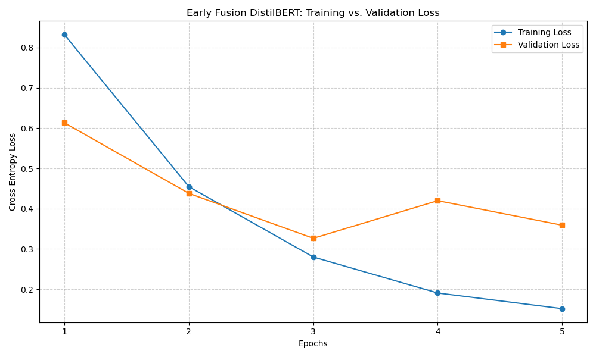

# E-Commerce Review Rating Classification

An end-to-end natural-language processing pipeline for predicting one-to-five
star product ratings from women's clothing reviews. The project compares an
LSTM baseline, review-only DistilBERT, and an early-fusion DistilBERT model that
combines review text with structured customer and product metadata.

## Research question

Does converting structured metadata into natural-language context improve a
transformer's rating predictions compared with using the review text alone?

The early-fusion input includes reviewer age, recommendation status,
department, review title, and review text. Experiments are repeated across
three random seeds to measure model stability rather than relying on a single
run.

## Pipeline

```text
Kaggle acquisition
      |
Pydantic validation and cleaning
      |
SQLite persistence
      |
Class balancing and stratified train/validation/test split
      |
LSTM, DistilBERT, and early-fusion DistilBERT experiments
      |
Accuracy, macro precision/recall/F1, MSE, and confusion matrices
```

## Results

The transformer models substantially outperformed the LSTM baseline in macro
F1. The multi-seed experiment also shows that early fusion can achieve the
strongest individual run, while its performance varies more across seeds than
review-only DistilBERT.



The representative early-fusion confusion matrix shows that most mistakes
occur between adjacent rating classes.



Training and validation loss for the early-fusion model:



## Repository structure

```text
main.py                       End-to-end experiment orchestrator
src/acquire.py                Kaggle dataset acquisition
src/validate.py               Pydantic schema validation and cleaning
src/storage.py                SQLite persistence
src/build_dataset.py          Feature construction, balancing, and splitting
src/process.py                DistilBERT and LSTM tokenization
src/models/baselines.py       Logistic-regression helper and LSTM baseline
src/models/bert_classifier.py DistilBERT classifier
src/train.py                  Reproducible PyTorch training loop
src/evaluate.py               Metrics and confusion matrices
assets/                       Selected experiment visualizations
```

## Setup

Python 3.11 is recommended.

```bash
conda env create -f environment.yml
conda activate nlp-final
```

Alternatively:

```bash
python -m pip install -r requirements.txt
```

The project uses the
[Women's E-Commerce Clothing Reviews](https://www.kaggle.com/datasets/nicapotato/womens-ecommerce-clothing-reviews)
dataset. Configure Kaggle credentials using the official
[Kaggle API instructions](https://github.com/Kaggle/kaggle-api), then run:

```bash
python main.py
```

The pipeline downloads and validates the data, builds a local SQLite database,
trains every model across seeds 42, 123, and 999, evaluates the held-out test
set, and writes generated figures to `plots/`. Training all transformer runs
can take substantial time without a GPU.

## Portfolio notice

This is a history-free, sanitized portfolio edition of coursework completed
for UCL ELEC0141 Deep Learning for Natural Language Processing. It contains
the author's implementation and selected generated figures, but excludes the
assignment specification, autograding configuration, feedback, credentials,
dataset records, databases, notebooks, and model weights.

Dataset use remains subject to Kaggle's terms and the rights of the original
data provider. No licence is granted for reuse of this source code unless the
author provides one separately. Do not submit this project, or derivatives of
it, as academic work.
